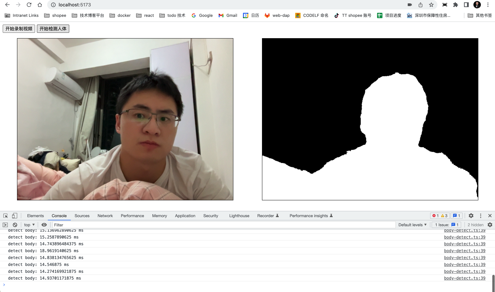

### 说明

1. 打开电脑摄像头（渲染在 video 标签）
2. 检测画面人体
   

3. 生成 png/data uri 遮罩图层
4. 让字幕在 video 标签上滚动，期望效果：字幕不会漂浮在人体前面

https://user-images.githubusercontent.com/12020551/200715518-0b78fa09-06d2-4e90-a848-5d26f4e92199.mp4

